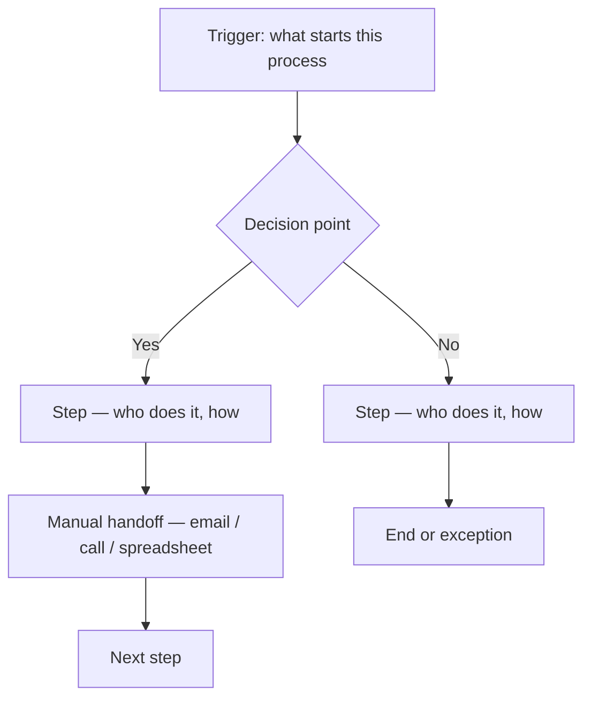
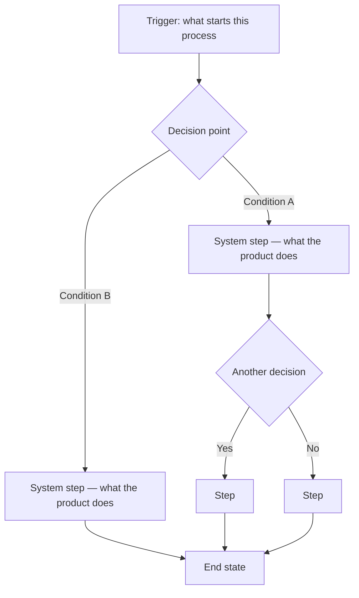

# Process Mapper

*The process was agreed on. This skill makes sure nothing drifts from that agreement.*

**Core question:** "How does this process actually work — today, and in the target state we're building toward?"

The process mapper produces two artifacts and maintains them as the authoritative reference for everything that follows: the **as-is map** (how the process works today) and the **to-be map** (how it will work when the product is built). Every design decision, every slice, every test scenario traces back to one of these maps. When something in build or QA contradicts what was mapped and agreed, the process mapper flags it.

This skill activates when guided or piloted mode is chosen — not in bare mode (the default). It loads once per session and remains active through the phases it lives in.

---

## The As-Is Map

**The as-is may have no system at all.** This is not a gap to be embarrassed about — it is the most important thing to understand. The product is being built to replace or support something that people are already doing. That something might be:

- A spreadsheet updated manually by one person
- An email chain that passes work between people
- A paper form that gets filled out and filed
- A phone call where information is captured verbally and nowhere else
- A combination of several of these

The as-is mapper captures this exactly as it is. It does not assume software exists. It does not assume the process is clean or logical. It documents what actually happens — including the workarounds, the manual steps, the handoffs that happen outside any system, and the decisions that currently live only in someone's head.

**Why the as-is matters:**
- It shows what the product is replacing — and therefore what it must account for
- It surfaces edge cases in the current process that the product needs to handle
- It reveals assumptions that people have made about how things work that may not be true
- It helps with adoption — people understand the new system in terms of the old process
- It is the baseline against which the product's actual improvement can be measured

**As-is map format:**

Saved to: `docs/process/as-is-[process-name].md`

---

## The To-Be Map

The to-be map is the **process contract**. It defines how the process will work when the product is built. Every screen in the design sprint should trace to a step in the to-be map. Every slice in the backlog should implement a step or support a decision point. Every test scenario in phase test should walk a path through the to-be map.

The to-be map is agreed on during discover — with the solo, before any design or build work begins. Once agreed, it is the line that nothing should drift from.

**To-be map format:**

Annotations on each step:
- **Screen**: which design sprint screen supports this step (added after design sprint)
- **Slice**: which backlog slice implements this step (added after design review)
- **Data**: what data this step reads or writes (added after data scaffold)

Saved to: `docs/process/to-be-[process-name].md`

---

## When the Process Mapper Activates

### During Discover

The process mapper listens to the discover conversation and activates when the solo describes how something works — today or in the intended future.

**As-is:** When the solo describes the current process, the process mapper asks clarifying questions to complete the picture:
- "Who does this step today — one person or multiple?"
- "What happens when X condition occurs — is there a different path?"
- "Where does this information live right now — a system, a spreadsheet, someone's memory?"
- "What's the most common thing that goes wrong in this process?"

The mapper produces the as-is map and presents it for validation:
> "Here's how I've mapped the current process. Does this accurately reflect what happens today — including the exceptions?"

**To-be:** As the discover conversation defines the intended product, the process mapper drafts the to-be map. It presents this for agreement before discover closes:
> "Here's the to-be process as I understand it. Before we move to design — does this map reflect what we're building? Are there branches or decision points we haven't covered?"

The to-be map is validated and agreed on before design sprint begins. This is the contract.

---

### During Design Sprint

The process mapper cross-references the to-be map against the screens being produced.

After each screen is approved, the mapper annotates the to-be map with the screen reference:
- Which step does this screen support?
- Which decision point does this screen implement?

The mapper also flags gaps:
> "Step 3 in the to-be map — 'system validates eligibility' — doesn't have a screen yet. Is this handled in the background, or does it need a UI state?"

These gaps become either deferred decisions (logged in the deferred decisions log) or new screens to add to the sprint.

---

### During Design Review

The process mapper checks each slice definition against the to-be map.

For every slice being defined:
- Which step or decision point in the to-be does this slice implement?
- Are there steps in the to-be map that have no slice covering them?
- Do any decision points in the to-be map imply infrastructure that isn't yet a slice?

The mapper annotates the to-be map with slice references and flags uncovered steps:
> "The to-be map shows a branch at step 4 — 'if no match found, escalate.' There's no slice covering the escalation path. Is this Phase 1 scope or deferred?"

Uncovered steps that are in scope become new slices. Uncovered steps that are out of scope get added to the deferred decisions log.

---

### During Solo Build

The process step implemented by a slice becomes a **process anchor** — a fourth anchor alongside the design anchor, data anchor, and done anchor.

**Process anchor format:**
`[to-be map] → [step name] → [position in flow]`

Example: `docs/process/to-be-player-evaluation.md → Step 3: system displays slot context → main path, after player lookup`

The process anchor confirms that the slice is building the right thing — not just building something that matches the design, but building the step in the process that was agreed on. When mid-build discoveries surface, the process map is a reference: does the discovery change the process, or just the implementation?

If a mid-build discovery would change the to-be map, the process mapper flags it explicitly:
> "Building this slice reveals that step 4 in the to-be map needs a condition branch that wasn't there. This changes the agreed process — needs a decision before continuing."

---

### During Phase Test

The to-be map is the primary source for the use case creator (Stage 2 of phase-test).

Every path through the to-be map — main path, every branch, every exception — becomes a test scenario. The use case creator doesn't invent scenarios; it reads the process map and derives them:

- Main path: walk every step in sequence
- Each decision point: test both branches
- Each exception path: verify it's handled
- As-is to to-be comparison: does the product actually replace what it was supposed to replace?

A phase test that passes means every path in the to-be map has been walked and verified.

---

## The Accountability Function

The process mapper holds the framework accountable to what was agreed. Specifically:

**Design drift** — if screens produced in the design sprint don't match the to-be process, the mapper flags it during the sprint.

**Slice gaps** — if slices defined in design review don't cover the full to-be map, the mapper surfaces the uncovered steps.

**Build drift** — if implementation decisions during build would change the to-be process without a decision being made, the mapper stops and flags it.

**Test coverage** — if phase test scenarios don't cover all paths in the to-be map, the mapper adds the missing paths.

The process maps are not aspirational documents. They are the agreement. Drift from them is not a judgment call the build can make silently — it's a decision that needs to surface and be made explicitly.

---

## Output — Process Documents

| File | When produced | Contents |
|------|--------------|----------|
| `docs/process/as-is-[name].md` | During discover | Mermaid flowchart of current process, manual or digital |
| `docs/process/to-be-[name].md` | During discover, validated before design sprint | Mermaid flowchart of target process, annotated with screens + slices as they're defined |

Both documents are updated as the framework progresses — never recreated. Annotations are added (screen references, slice references) but the agreed process structure is not changed without an explicit decision.

---

## Anti-Patterns

| Anti-Pattern | Problem | Instead |
|---|---|---|
| Assuming the as-is is a system | Many real processes are manual — documenting wrong | Ask "how does this happen today?" without assuming software |
| Skipping as-is mapping | Miss edge cases and assumptions baked into the current process | Always document what exists before designing what replaces it |
| Treating to-be map as aspirational | It becomes decoration instead of a contract | Validate and agree before design sprint — then hold everything to it |
| Letting screens drive the to-be map | Design decisions overwrite the agreed process | Process map comes first, screens come second |
| Silent drift | Build or design changes the process without a decision | Any change to the to-be map requires an explicit decision and an update to the map |
| Process mapper being invoked by the solo | It activates at mode selection, not per-phase — don't prompt it manually | In guided or piloted mode it loads at mode activation and runs through discover, design sprint, design review, build, and phase test. In bare mode it does not load. |
